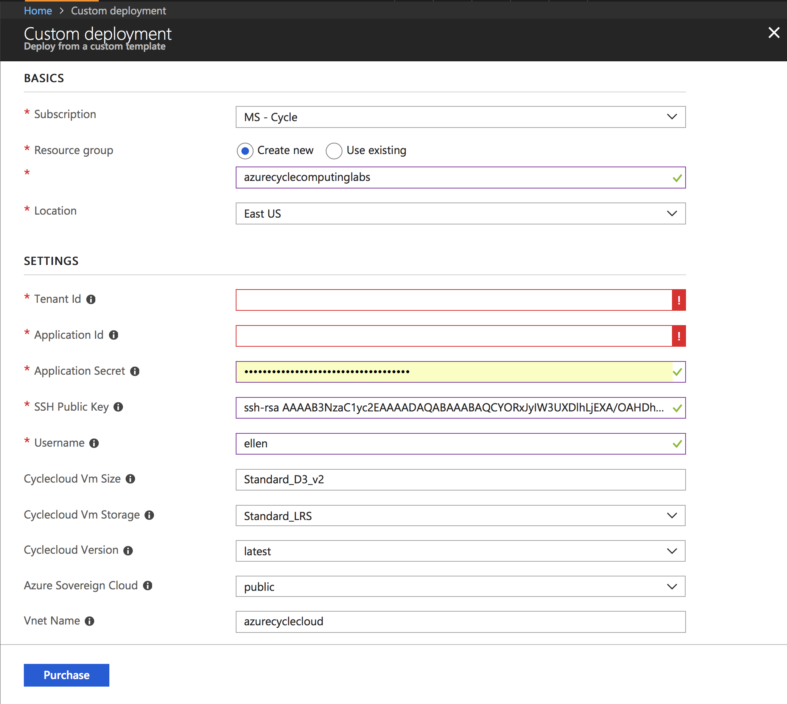
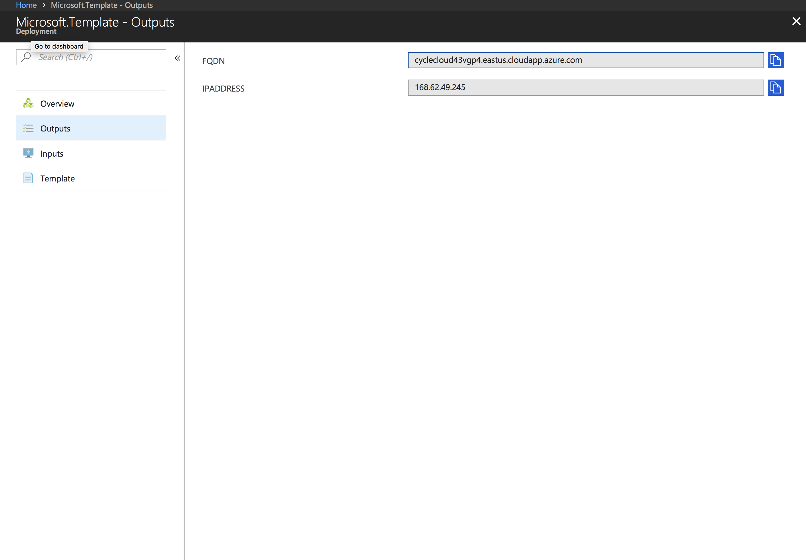
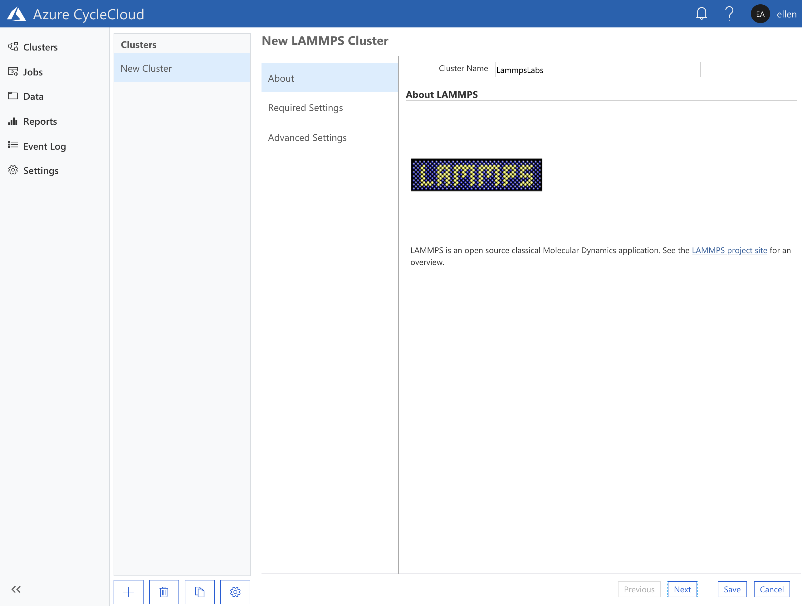
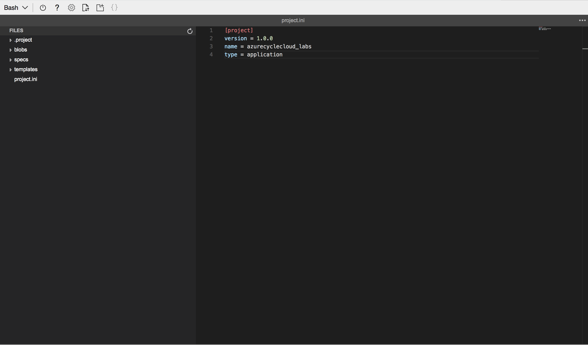

# Azure CycleCloud Labs

* Microsoft Specialized Compute (HPC) Team - <mailto:askcyclecloud @
  microsoft.com>

This lab focuses on helping you become familiar with Azure CycleCloud, a tool for orchestrating HPC clusters in Azure.

## Pre-requisites
* Most HPC environments run on Linux operating systems, and this lab assumes basic familiarity with Linux systems.
* A Shell session in a terminal. If you are using a Windows machine, we
  encourage you to use the browser-based Bash shell available at
  https://shell.azure.com. Alternatively, you can install [Windows Subsystem for
  Linux](https://docs.microsoft.com/en-us/windows/wsl/install-win10) on your
  machine. This lab will use screenshots on Azure Shell.
* A valid Azure subscription

There are several sections to this lab. Upon completion you should be able to
create a customized auto-scaling HPC cluster in your Azure subscription. 

[1. Starting an Azure CycleCloud server](#Starting-An-Azure-CycleCloud-Server)

[2. Start a Lammps cluster and submit sample jobs](#Starting-an-Auto-scaling-HPC-Cluster)

[3. Modifying a cluster template](#modifying-a-cluster-template)

[4. Adding a custom application](#Adding-a-custom-application)

[5. Connecting a standalone file-system (NFS)](#Adding-a-nfs-filer)


## 1. Starting An Azure CycleCloud Server
* There are several ways to install and setup an Azure CycleCloud server. For
  this lab, use the ARM deployment that is available in the
  [Quick-Start-Guide](https://review.docs.microsoft.com/en-us/azure/cyclecloud/quickstart-install-cyclecloud?branch=master)

* As you follow the steps below, please keep track of the following:
    1. The domain name (FQDN) of your Azure CycleCloud.
    2. The `username` used in the ARM template. If you followed the QSG, 
       the same `username` should be used in the Azure CycleCloud web UI.
    3. The `password` created in the Azure CycleCloud web UI for your user.


### 1.1 Log into https://shell.azure.com
```CLI
Requesting a Cloud Shell.Succeeded.
Connecting terminal...

Welcome to Azure Cloud Shell

Type "az" to use Azure CLI 2.0
Type "help" to learn about Cloud Shell
ellen@Azure:~$
```

### 1.2 Figure out your username
```
ellen@Azure:~$ whoami
ellen
ellen@Azure:~$
```

### 1.3 Generate an SSH keypair (if you do not already have one)
* In Cloud Shell, run:
```CLI
ellen@Azure:~$ ssh-keygen -f ~/.ssh/id_rsa  -N "" -b 4096
Generating public/private rsa key pair.
Your identification has been saved in /home/ellen/.ssh/id_rsa.
Your public key has been saved in /home/ellen/.ssh/id_rsa.pub.
The key fingerprint is:
SHA256:L8DFLyfXbKQT5PZZFwTGFnAY4ODCtYFyhGhoHFTpbKM ellen@cc-c6733553-7b96c85fb8-hbmlw
The key's randomart image is:
+---[RSA 4096]----+
|+o+.+..+ .oo==+o |
|.= +.oo.=o .oo  .|
|o o oo oo.+ o . .|
|   = ... o B o . |
|  o . o S * *    |
| E     . * o     |
|        . .      |
|         .       |
|                 |
+----[SHA256]-----+
ellen@Azure:~$
```
### 1.4 Retrieve the SSH-pubkey
```CLI
ellen@Azure:~$ cat ~/.ssh/id_rsa.pub
ssh-rsa AAAAB3NzaC1yc2EAAAADAQABAAACAQCwIvmC4K/0BUwOBqCsPxw5Ht8qWyDkorrU+gc6cJbohREoMFZkMlGEe2XqIyYTpHAu0ISicZEJ4MoWExPFrrZRqoYAHPrHyNnie9tVR5UMkqzNhs31qEWLtfEBOrcJIsPNdFuvnAqiQnhMQut3Jtamjc3XnMU8kJ3yL/+xIU4vKkQ8XIey+GGowR69oJI37mYKr9jT9dejB4gP2l6JyrVehnOG6QXRtg/gzFgyX08u8wKhuohNIPLlf2VzIXQml69P9PcD3muePIxi/JsJ6hb6czMCqhyHSFA42XpUpeWTml41HuBO9R5Bcsb3Q3j4MTKQOjtssz9Dx3pwtZ+tn9mg8TLMsk9d3Ip8FVXbe9ABleutJLIYGIUcZ3GlMdnRP62Wdyzrh0VEsoCfkHjUq2qFo8Hd1j0bkR1coSr2vFZXz6my+92a8nX7dJMPH5y+DG+ZuZchBXrwy8xVSNccnqRRn1A5xKdxY5SusbUQEirYPS7oR64CH4QeH6d5iQ2p2Z2cVWYbz/DjJNoCF0Cbzp9w1KprpErlrtd1epIGQTUDgx4YhChyrdXQiYCJBJ1jvhJcWfKj6rHz94eTEr6S5W4etP/IuACqKTpmAxQqSdU7NdHZVPH8c6w89JX3DAYRjg0PKVm56Ib6C+kct8M6/NQQeyhi5DM0SGW+T7tBjDxsUQ== ellen@cc-c6733553-7b96c85fb8-hbmlw
ellen@Azure:~$
```
### 1.5 Create a service principal
```CLI
ellen@Azure:~$ az ad sp create-for-rbac --name cyclecloudlabs
{
    "appId": "xxxxxxxx-xxxx-xxxx-xxxx-xxxxxxxxxxxx",
    "displayName": "cyclecloudlabs",
    "name": "http://cyclecloudlabs",
    "password": "xxxxxxxx-xxxx-xxxx-xxxx-xxxxxxxxxxxx",
    "tenant": "xxxxxxxx-xxxx-xxxx-xxxx-xxxxxxxxxxxx"
}
```

### 1.6 Deploy Azure CycleCloud
[](https://portal.azure.com/#create/Microsoft.Template/uri/https%3A%2F%2Fraw.githubusercontent.com%2FCycleCloudCommunity%2Fcyclecloud_arm%2Fdeploy-azure%2Fazuredeploy.json)

* Click on the button above, and you will be taken to a deploy page in the Azure
  portal 

Enter the required information:

* *Tenant ID*: The `tenant` listed above in the service principal
* *Application ID*: `appId` of the service principal
* *Application Secret*: `password` of the service principal
* *SSH Public Key*: Copy and paste here the output of step 1.4
* *Username*: The output of step 1.2 (e.g. *johnsmith* instead of
  *johnsmith@domain.com*)

The deployment process runs an installation script as a custom script extension,
which installs and sets up CycleCloud. This process takes between 5 and 8 mins.

### 1.7 Retrieve the Domain Name (FQDN) of the Azure CycleCloud VM
* When the deployment is completed you can retrieve the fully qualified domain
  name of the Azure CycleCloud VM from the Azure portal or using the CLI in
  Cloud Shell: 

```CLI
# replace ResourceGroupName with the one that you used
ellen@Azure:~$ az group deployment list -g ${ResourceGroupName} --query "[0].properties.outputs.fqdn.value"
"cyclecloud43vgp4.eastus.cloudapp.azure.com"
```

### 1.8 Logging into the Azure CycleCloud server for the first time
* In your web browser go to https://fqdn (where fqdn is the addressed retrieved
  above).
* You will be asked to enter a site name in the first screen, pick any name you
  like
* Accepting the EULA on the second screen brings you to a page that asks you to
  create a admin user.
    - Use the same `username` used above in step 1.5. Remember that this is also
      the username of your Cloud Shell session.
    - Choose a password that meets the minimum requirements. 

## 2.  Starting an auto-scaling HPC cluster
In this section, you will start a cluster using PBS-Pro as a scheduler, with
LAMMPS as a solver

### 2.1 Start a new LAMMPS cluster in Azure CycleCloud

If you do not have a cluster that is already running, the default start page of
Azure CycleCloud will display a wall of applications and cluster types that are
distributed with each install
* Find the LAMMPS cluster icon and select it. 
* Provide a name for the new cluster and move on to the *Required Settings*
  section. 
* Select a VM type that you should like to use as a `Execute VM Type`, we
  recommend the H16r if you have quota for these.
* In the networking subnet dropdown, select the subnet which has "-compute" as a
  suffix. This subnet was created as part of the ARM deployment. 
* The *Advanced Settings* section allows you to configure the cluster to use a
  different OS, set up different projects, as well as to attach a public IP
  address to the cluster nodes. There is no need to change any settings here for
  the purposes of this lab. 
* Click the *Save* button on the bottom right-hand corner of the page to create
  and save this cluster.
* Your cluster now appears greyed-out in the cluster page. Click *Start* button
  to provision the cluster resources in Azure. 
* Starting up the cluster for the first time takes about 10 mins for it to be
  ready. By default, only the master (or head) node of the cluster is started.
  Azure CycleCloud provisions all the necessary network and storage resources
  needed by the master node, and also sets up the scheduling environment in the
  cluster.
* The master node status bar turns green when the cluster is ready to use 

### 2.2 Connecting into the master node and submitting a LAMMPS job

As part of the ARM deployment process in section 1 above, the SSH public key you
provided is stored in the Azure CycleCloud application server and pushed into
each cluster that you create. 

As a result of that, you are able to use your SSH private key to log into the
master node.

* Retrieve the public IP address of the cluster headnode by selecting the master
  node in the cluster management pane, and then clicking on the connect button
  that appears below.
*  The pop-up window shows the connection string you would use to connect to the
   cluster.
*  
*  Use your SSH client to connect to the master node. You could also use the one
   that is available in Cloud Shell:
```CLI
ellen@Azure:~$ ssh ellen@40.114.123.148
Last login: Thu Aug  2 20:55:34 2018 from 97-113-237-75.tukw.qwest.net

 __        __  |    ___       __  |    __         __|
(___ (__| (___ |_, (__/_     (___ |_, (__) (__(_ (__|
        |

Cluster: LammpsLabs
Version: 7.5.0
Run List: recipe[cyclecloud], role[pbspro_master_role], recipe[cluster_init]
[ellen@ip-0A000404 ~]$
```

* You can verify that the job queue is empty by using the `qstat` command:
```CLI
[ellen@ip-0A000404 ~]$ qstat -Q
Queue              Max   Tot Ena Str   Que   Run   Hld   Wat   Trn   Ext Type
---------------- ----- ----- --- --- ----- ----- ----- ----- ----- ----- ----
workq                0     0 yes yes     0     0     0     0     0     0 Exec
[ellen@ip-0A000404 ~]$
```

* Change to the demo directory, where you can find a sample LAMMPS job, and submit the job using existing `runpi.sh` script.
```
[ellen@ip-0A000404 ~]$ cd demo/
[ellen@ip-0A000404 demo]$ ./runpi.sh
0[].ip-0A000404
```

* Note, if you're curious, you can view the contents of the `runpi.sh` script by running the `cat` command. This script prepares a sample job which contains 1000 individual tasks, and submits that job using the `qsub` command.
```
[ellen@ip-0A000404 demo]$ cat runpi.sh
#!/bin/bash
mkdir -p /shared/scratch/pi
cp ~/demo/pi.py /shared/scratch/pi
cp ~/demo/pi.sh /shared/scratch/pi
cd /shared/scratch/pi
qsub -J 1-1000 /shared/scratch/pi/pi.sh
```

* Verify that the job is now in the queue
```
[ellen@ip-0A000404 ~]$ qstat -Q
Queue              Max   Tot Ena Str   Que   Run   Hld   Wat   Trn   Ext Type
---------------- ----- ----- --- --- ----- ----- ----- ----- ----- ----- ----
workq                0     1 yes yes     1     0     0     0     0     0 Exec
[ellen@ip-0A000404 ~]$
```

* The autoscaling hook in the PBS scheduler picks up the job and submits a
  resource request to the Azure CycleCloud server. You will see nodes being
  provisioned in the Azure CycleCloud UI within a minute.  Note that CycleCloud will not 
  provision more cores than the limit set on the cluster's autoscaling 
  settings. In this case, the sample job contains 1000 tasks, but CycleCloud 
  will only provision up to 100 cores worth of VMs. 

* After the execute nodes are provisioned, their status bars will turn green, and the
  job's tasks will start running. For non-tightly coupled jobs, where the individual 
  tasks can independently execute, jobs will start running as soon as any VM is ready. 
  For tightly coupled jobs (i.e. MPI jobs), jobs will not start executing until every VM
  associated with the jobs is ready.

* Verify that the job is complete by running the `qstat -Q` command periodically. The jobs should finish quickly, in a minute or two. 
```
[ellen@ip-0A000404 demo]$ qstat -Q
Queue              Max   Tot Ena Str   Que   Run   Hld   Wat   Trn   Ext Type
---------------- ----- ----- --- --- ----- ----- ----- ----- ----- ----- ----
workq                0     0 yes yes     0     0     0     0     0     0 Exec
```

* With no more jobs in the queue, the execute nodes will start auto-stopping,
  and your cluster will return to just having the master node.

## 3. Modifying a cluster template
The cluster icons that are packaged into each CycleCloud installer are great for
simple use cases, but frequently users find themselves needing to customize
these. 

By default, Azure CycleCloud Clusters' master nodes are also NFS servers,
providing a shared filesystem for other nodes in the cluster. In this section,
we will edit the default cluster configuration and add two managed disks in a
RAID 0 configuration to the master node, and export this as the file share.

In this section, you will be introduced to the concept of
[Projects](https://docs.microsoft.com/en-us/azure/cyclecloud/projects) in
CycleCloud. Projects encapsulate both scripts and template files that define the
Azure CycleCloud cluster types. You will need to install the Azure CycleCloud
CLI in your environment. Once again, you will need a Shell environment, and you
can use the Azure Cloud Shell for this section if that is more convenient.

### 3.1 Installing and setting up the Azure CycleCloud CLI
* Download the installers
```CLI
ellen@Azure:~$ wget https://cyclecloudarm.blob.core.windows.net/cyclecloudrelease/7.5.0/cyclecloud-cli.zip
--2018-08-02 21:48:30--  https://cyclecloudarm.blob.core.windows.net/cyclecloudrelease/7.5.0/cyclecloud-cli.zip
Resolving cyclecloudarm.blob.core.windows.net (cyclecloudarm.blob.core.windows.net)... 52.239.154.132
Connecting to cyclecloudarm.blob.core.windows.net (cyclecloudarm.blob.core.windows.net)|52.239.154.132|:443... connected.
HTTP request sent, awaiting response... 200 OK
Length: 4546572 (4.3M) [application/zip]
Saving to: ‘cyclecloud-cli.zip’

cyclecloud-cli.zip                      100%[==============================================================================>]   4.34M  --.-KB/s    in 0.04s

2018-08-02 21:48:31 (112 MB/s) - ‘cyclecloud-cli.zip’ saved [4546572/4546572]
```
* Unzip the file
```CLI
ellen@Azure:~$ unzip cyclecloud-cli.zip
Archive:  cyclecloud-cli.zip
   creating: cyclecloud-cli-installer/
   creating: cyclecloud-cli-installer/packages/
   creating: cyclecloud-cli-installer/support/
  inflating: cyclecloud-cli-installer/README
  inflating: cyclecloud-cli-installer/LICENSE
  inflating: cyclecloud-cli-installer/install.py
  inflating: cyclecloud-cli-installer/NOTICE
  inflating: cyclecloud-cli-installer/install.ps1
  inflating: cyclecloud-cli-installer/install.sh
  inflating: cyclecloud-cli-installer/support/virtualenv.py
  inflating: cyclecloud-cli-installer/support/wheel-0.31.1-py2.py3-none-any.whl
  inflating: cyclecloud-cli-installer/support/pip-10.0.1-py2.py3-none-any.whl
  inflating: cyclecloud-cli-installer/support/__init__.py
  inflating: cyclecloud-cli-installer/support/setuptools-39.1.0-py2.py3-none-any.whl
  inflating: cyclecloud-cli-installer/packages/cyclecloud-cli-sdist.tar.gz
  inflating: cyclecloud-cli-installer/packages/pogo-sdist.tar.gz
```
* Descend into the unzipped install directory and run the install script  
```CLI
ellen@Azure:~$ cd cyclecloud-cli-installer
ellen@Azure:~/cyclecloud-cli-installer$ ./install.sh
cyclecloud and pogo commands have been installed to /home/ellen/bin
ellen@Azure:~/cyclecloud-cli-installer$
```
* Connect the CLI to your Azure CycleCloud server The Azure CycleCloud CLI
  communicates with the server using a REST API, and to use it you first have to
  initalize it with your Azure CycleCloud server. 
    - Initialize the server. The CycleServer URL is FQDN of your application
      server set up in section 1.
    - The installed Azure CycleCloud server uses either a Let's Encrypt SSL
      cert, or a self-signed cert. Type `yes` when asked if you would allow an
      untrusted certificate
    - The CycleServer username is the same username as the one used to log into
      the web UI
    - The same goes with the password

    ellen@Azure:~$ cyclecloud initialize CycleServer URL:
    [http://localhost:8080] https://cyclecloud43vgp4.eastus.cloudapp.azure.com
    Detected untrusted certificate.  Allow?: [no] yes
    /home/ellen/.cycle/cli/local/lib/python2.7/site-packages/requests/packages/urllib3/connectionpool.py:734:
    InsecureRequestWarning: Unverified HTTPS request is being made. Adding
    certificate verification is strongly advised. See:
    https://urllib3.readthedocs.org/en/latest/security.html
    InsecureRequestWarning) CycleServer username: [ellen] ellen CycleServer
    password:
    /home/ellen/.cycle/cli/local/lib/python2.7/site-packages/requests/packages/urllib3/connectionpool.py:734:
    InsecureRequestWarning: Unverified HTTPS request is being made. Adding
    certificate verification is strongly advised. See:
    https://urllib3.readthedocs.org/en/latest/security.html
    InsecureRequestWarning)

    Generating CycleServer key... Initial account already exists, skipping
    initial account creation. CycleCloud configuration stored in
    /home/ellen/.cycle/config.ini ellen@Azure:~$

* Verify that the CycleCloud CLI is working With the show_cluster command, you
  should see the LAMMPS cluster started in section 2
```CLI
ellen@Azure:~$ cyclecloud show_cluster
--------------------
LammpsLabs : started
--------------------
Keypair:
Cluster nodes:
    master: Started e6e008a1259743f8406967a023633a6a 40.114.123.148 (10.0.4.4)
Total nodes: 1
ellen@Azure:~$
``` 

### 3.2 Creating a new CycleCloud Project
Azure CycleCloud clusters are defined using text files. To take a look at one of
these, use the CycleCloud CLI to create a new project, and generate a template
from it.

* Create a new CycleCloud Project Create a parent directory for cyclecloud
  projects, then create a new project with the `cyclecloud project init`
  command. 

    - In the example below, the project is named `azurecyclecloud_labs`. 
    - When asked for the `Default Locker`, specify `azure-storage`


```CLI
ellen@Azure:~$ mkdir ~/cyclecloud_projects/
ellen@Azure:~$ cd ~/cyclecloud_projects/
ellen@Azure:~/cyclecloud_projects$ cyclecloud project init azurecyclecloud_labs
Project 'azurecyclecloud_labs' initialized in /home/ellen/cyclecloud_projects/azurecyclecloud_labs
Default locker: azure-storage
ellen@Azure:~/cyclecloud_projects$ 
```

* Edit project.ini to change the application type

The `cyclecloud project init` command creates a new directory, and there is a
`project.ini` file inside that defines attributes for the project. You will need
to edit this file and specify that this project is of type `application`, which
will allow us to generate the appropriate template. 

If you are using Cloud Shell and prefer a text editor with a graphical user
interface, following the steps below will launch a [Cloud Shell
editor](https://azure.microsoft.com/en-us/blog/cloudshelleditor/). 

Insert the line `type = application` into `project.ini` and save the changes.
```CLI
ellen@Azure:~/cyclecloud_projects$ cd ~cyclecloud_projects/azurecyclecloud_labs
ellen@Azure:~/cyclecloud_projects/azurecyclecloud_labs$ code .
```


### 3.3 Generate a new cluster template file
* Run the `cyclecloud project generate_template` command to create a new cluster
  template. You will need to specify an output file location for the template.
*  
```CLI
ellen@Azure:~/cyclecloud_projects/azurecyclecloud_labs$ cyclecloud project generate_template templates/pbs_extended_nfs.template.txt
Cluster template written to templates/pbs_extended_nfs.template.txt
ellen@Azure:~/cyclecloud_projects/azurecyclecloud_labs$
```

### 3.4 Edit the cluster template file and add volumes to the NFS server
* Now modify the generated template file by editing it in an editor. Once again,
  we will use the Cloud Shell editor in this example.
```CLI
ellen@Azure:~/cyclecloud_projects/azurecyclecloud_labs$ code templates/pbs_extended_nfs.template.txt
```
After line 44, add the following blocks to the template file:
```INI
        # Add 2 premium disks in a RAID 0 configuration to the NFS export
        [[[volume nfs-1]]]
        Size = 512
        SSD = True
        Mount = nfs
        Persistent = true

        [[[volume nfs-2]]]
        Size = 512
        SSD = True
        Mount = nfs
        Persistent = true

        [[[configuration cyclecloud.mounts.nfs]]]
        mountpoint = /mnt/exports
        fs_type = ext4
        raid_level = 0
```
Save the changes. The template file should now look like this: 

This 15 lines express that two premium disks (SSD = True) of 512GB each should
be added to the master node when it is provisioned, in a RAID 0 config. This
volume is then mounted at `/mnt/exports` and formatted as an `ext4` filesystem.

The `Persistent = true` tag indicates that the two managed disks will not be
deleted when the cluster is terminated. However, they will be deleted if the
cluster is deleted. 

For more information about customizing volumes and mounts in a CycleCloud
cluster, refer to the [Storage section of the
documentation](https://docs.microsoft.com/en-us/azure/cyclecloud/attach-storage)

### 3.5 Import the new cluster template
* Using the CycleCloud CLI, import the template into the application server
```CLI
ellen@Azure:~/cyclecloud_projects/azurecyclecloud_labs$ cyclecloud import_template -f templates/pbs_extended_nfs.template.txt
Importing default template in templates/pbs_extended_nfs.template.txt....
---------------------------------
azurecyclecloud_labs : *template*
---------------------------------
Keypair:
Cluster nodes:
    master: off
Total nodes: 1
ellen@Azure:~/cyclecloud_projects/azurecyclecloud_labs$
```
* You should now see a new cluster type in the Azure CycleCloud UI 

### 3.6 Start the cluster
* Follow the proceedure in section 2 to start a new cluster base on this new
  cluster type.
* Log into the master node and verify that `/mnt/exports` is not a 1TB volume
