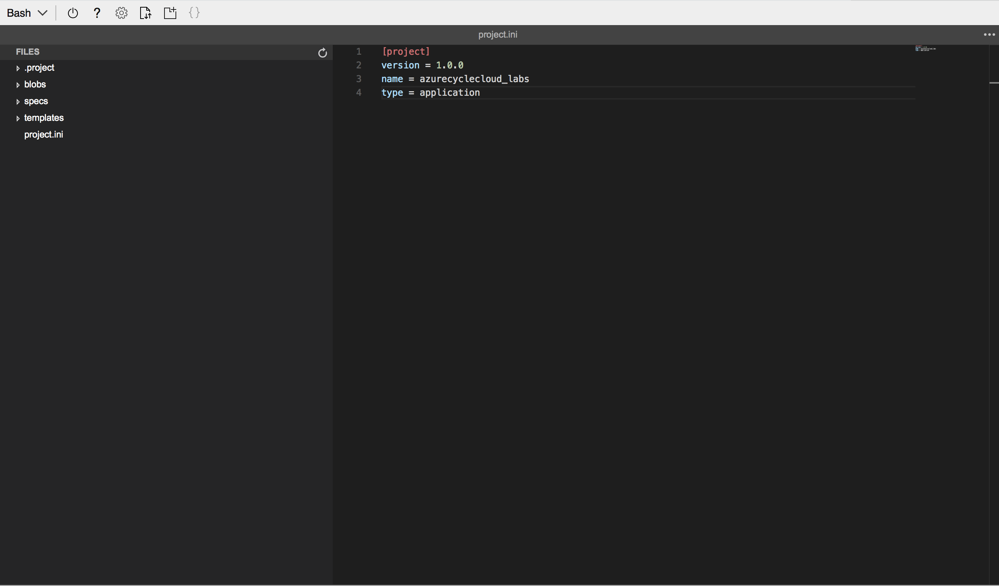
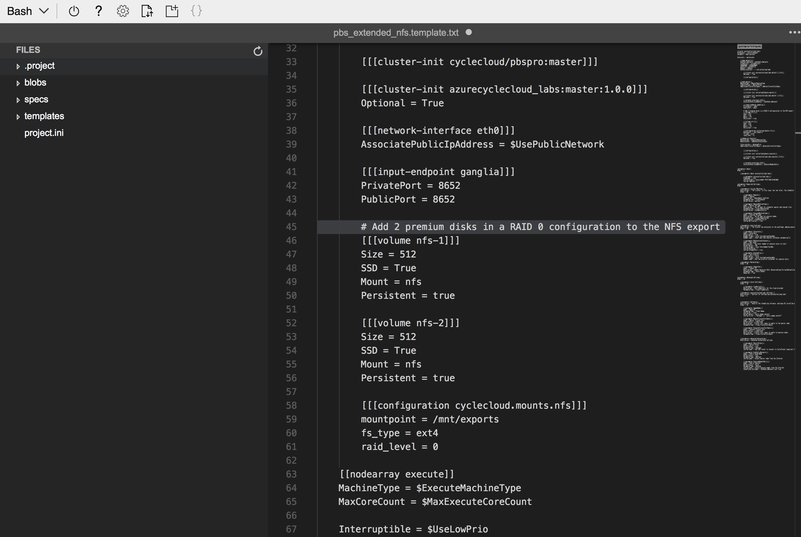
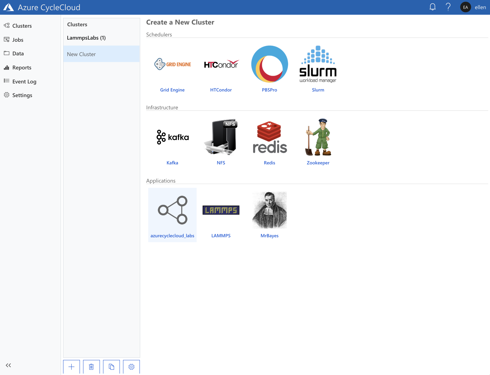

# Making a custom HPC cluster template with persistent storage

This lab focuses on showing how to extend a standard HPC cluster template to
include persistent storage. Persistent storage allows you to retain data on the
cluster after it terminates. Modifying cluster templates is a common and very
easy change. And it serves as a great introduction to more advanced
concepts such as projects and cluster template management.

Please send questions or comments to [the Azure CycleCloud PM team](mailto:askcyclecloud@microsoft.com).

## Goals

In this lab you will learn how to:

* Install and configure the Azure CycleCloud `cyclecloud` CLI tool
* Create a new CycleCloud project, a way of configuring and customizing a
  CycleCloud cluster
* Modify a cluster template to add storage to the cluster's NFS server
* Import cluster templates into CycleCloud in order to add new cluster type
* Create a new cluster from a custom cluster type, start it, and verify that the persistent storage has been added to the file system

## Pre-requisites

* Standard lab
  [prerequisites](https://github.com/CycleCloud/cyclecloud_tutorials/blob/master/README.md#prerequisites)

## 3. Modifying a cluster template

Azure CycleCloud's cluster types are great for standard use cases. But
occassionally users find themselves needing to customize the clusters for more
advanced or differently configured deployments.

A common customization is adding managed disks to a VM in a
compute cluster. By default, in most Azure CycleCloud clusters the master nodes
are also NFS servers, providing a shared filesystem for other nodes in the
cluster. 

In this section, we will edit the default cluster configuration and add two
managed disks in a RAID 0 configuration to the master node, and export the disks
as the file share.

Note that in this section, we introduce the concept of CycleCloud
[Projects](https://docs.microsoft.com/en-us/azure/cyclecloud/projects). Projects
encapsulate both scripts and template files that define the Azure CycleCloud
cluster types. You will need to install the Azure CycleCloud CLI in your
environment. Once again, we will use the [Azure Cloud Shell](https://shell.azure.com) 
as our shell environment.

### 3.1 Installing and setting up the Azure CycleCloud CLI

* If you are still logged onto the LAMMPS master node from the [previous lab](/Lab1/Tutorial.md),
  return to Cloud Shell by running the `exit` command.

  ```sh
  [ellen@ip-0A000404 ~]$ exit
  logout
  Connection to 40.114.123.148 closed.
  ellen@Azure:~$
  ```

* Download the CycleCloud command line installer into the Cloud Shell
  environment by running the following command from the prompt:

  ```sh
  ellen@Azure:~$ wget https://cyclecloudarm.blob.core.windows.net/cyclecloudrelease/7.5.0/cyclecloud-cli.zip
  --2018-08-02 21:48:30--  https://cyclecloudarm.blob.core.windows.net/cyclecloudrelease/7.5.0/cyclecloud-cli.zip
  Resolving cyclecloudarm.blob.core.windows.net   (cyclecloudarm.blob.core.windows.net)... 52.239.154.132
  Connecting to cyclecloudarm.blob.core.windows.net   (cyclecloudarm.blob.core.windows.net)|52.239.154.132|:443... connected.
  HTTP request sent, awaiting response... 200 OK
  Length: 4546572 (4.3M) [application/zip]
  Saving to: ‘cyclecloud-cli.zip’
  
  cyclecloud-cli.zip                      100%  [==============================================================================>]     4.34M  --.-KB/s    in 0.04s
  
  2018-08-02 21:48:31 (112 MB/s) - ‘cyclecloud-cli.zip’ saved [4546572/4546572]
  ellen@Azure:~$
  ```

* Unzip the file:

  ```sh
  ellen@Azure:~$ unzip cyclecloud-cli.zip 
  Archive:  cyclecloud-cli.zip
     creating: cyclecloud-cli-installer/
     creating: cyclecloud-cli-installer/packages/
     creating: cyclecloud-cli-installer/support/
    inflating: cyclecloud-cli-installer/README
    inflating: cyclecloud-cli-installer/LICENSE
    inflating: cyclecloud-cli-installer/install.py
    inflating: cyclecloud-cli-installer/NOTICE
    inflating: cyclecloud-cli-installer/install.ps1
    inflating: cyclecloud-cli-installer/install.sh
    inflating: cyclecloud-cli-installer/support/virtualenv.py
    inflating: cyclecloud-cli-installer/support/wheel-0.31.1-py2.py3-none-any.whl
    inflating: cyclecloud-cli-installer/support/pip-10.0.1-py2.py3-none-any.whl
    inflating: cyclecloud-cli-installer/support/__init__.py
    inflating: cyclecloud-cli-installer/support/setuptools-39.1.0-py2.py3-none-any.whl
    inflating: cyclecloud-cli-installer/packages/cyclecloud-cli-sdist.tar.gz
    inflating: cyclecloud-cli-installer/packages/pogo-sdist.tar.gz
  ellen@Azure:~$
  ```

* Change into the unzipped install directory, and run the install script  

  ```sh
  ellen@Azure:~$ cd cyclecloud-cli-installer
  ellen@Azure:~/cyclecloud-cli-installer$ ./install.sh
  cyclecloud and pogo commands have been installed to /home/ellen/bin
  ellen@Azure:~/cyclecloud-cli-installer$
  ```

  * If you receive the error `'/home/ellen/bin' not found in your PATH
  environment variable. Make sure to update it`, you can fix it as follows:

    ```sh
    ellen@Azure:~$ echo $PATH
    /usr/local/sbin:/usr/local/bin:/usr/sbin:/usr/bin:/sbin:/bin:/usr/local/go/bin:/opt/mssql-tools/bin
    ellen@Azure:~$ export PATH=~/bin:$PATH
    ellen@Azure:~$ echo $PATH
    /home/ellen/bin:/usr/local/sbin:/usr/local/bin:/usr/sbin:/usr/bin:/sbin:/bin:/usr/local/go/bin:/opt/mssql-tools/bin
    ```

* Connect the CLI to your Azure CycleCloud server.

  The Azure CycleCloud CLI communicates with the server over a REST API. To use
  it you first have to initialize it using the `initialize` command.
  * The CycleServer URL is the FQDN of your application
      server set up in [Lab 1 Section 1.7](/Lab1/Tutorial.md#1.7).
  * The installed Azure CycleCloud server uses either a Let's Encrypt SSL
      certificate or a self-signed certificate. Type `yes` when asked if you allow an
      untrusted certificate.
  * The CycleServer username is the one use to log into the CycleCloud web portal.
  * The CycleServer password is the password for the user above.

  ```sh
  ellen@Azure:~$ cyclecloud initialize
  CycleServer URL: [http://localhost:8080] https://{FQDN}
  Detected untrusted certificate.  Allow?: [no] yes
  /home/ellen/.cycle/cli/local/lib/python2.7/site-packages/requests/packages/urllib3/connectionpool.py:734: InsecureRequestWarning: Unverified HTTPS request is being made. Adding
  certificate verification is strongly advised. See: https://urllib3.readthedocs.org/en/latest/security.html
    InsecureRequestWarning)
  CycleServer username: [ellen] ellen 
  CycleServer password:
  /home/ellen/.cycle/cli/local/lib/python2.7/site-packages/requests/packages/urllib3/connectionpool.py:734: InsecureRequestWarning: Unverified HTTPS request is being made. Adding
  certificate verification is strongly advised. See: https://urllib3.readthedocs.org/en/latest/security.html
    InsecureRequestWarning)

  Generating CycleServer key...
  Initial account already exists, skipping initial account creation.
  CycleCloud configuration stored in /home/ellen/.cycle/config.ini
  ellen@Azure:~$
  ```

* Verify that the CycleCloud CLI works using the `show_cluster` command. The command
  should display the LAMMPS cluster you created in [Lab 1](/Lab1/Tutorial.md#2.1).

  ```sh
  ellen@Azure:~$ cyclecloud show_cluster
  --------------------
  LammpsLabs : started
  --------------------
  Keypair:
  Cluster nodes:
      master: Started e6e008a1259743f8406967a023633a6a 40.114.123.148 (10.0.4.4)
  Total nodes: 1
  ellen@Azure:~$
  ```

### <a name="3.2"></a> 3.2 Creating a new CycleCloud Project

Azure CycleCloud clusters are defined using text files. To take a look at one of
these, use the CycleCloud CLI to create a new project, and generate a template
from it.

* Create a new CycleCloud Project.

  Create a parent directory for cyclecloud
  projects, then create a new project with the `cyclecloud project init`
  command.

  * In the example below, the project is named `azurecyclecloud_labs`.
  * When asked for the `Default Locker`, specify `azure-storage`. This was
      created for you during deployment.

  ```sh
  ellen@Azure:~$ mkdir ~/cyclecloud_projects/
  ellen@Azure:~$ cd ~/cyclecloud_projects/
  ellen@Azure:~/cyclecloud_projects$ cyclecloud project init azurecyclecloud_labs
  Project 'azurecyclecloud_labs' initialized in /home/ellen/cyclecloud_projects/azurecyclecloud_labs
  Default locker: azure-storage
  ellen@Azure:~/cyclecloud_projects$ 
  ```

* Set the project type to `application`.

  `cyclecloud project init` creates a new directory (`azurecyclecloud_labs`),
  and adds a `project.ini` file inside that defines attributes for the project.
  You will need to edit this file to mark this project as an `application` type.
  This allows us to generate the appropriate template.

  We will use the [Cloud Shell editor](https://azure.microsoft.com/en-us/blog/cloudshelleditor/)
  to modify the file but you can use another editor (such as `vi` or `emacs`).

  Add the line `type = application` into `project.ini` and save the changes.

  ```sh
  ellen@Azure:~/cyclecloud_projects$ cd ./azurecyclecloud_labs
  ellen@Azure:~/cyclecloud_projects/azurecyclecloud_labs$ code .
  ```

  
  
### 3.3 Generate a new cluster template file

* Run the following command to create a new cluster template. The last argument
  is the output file that will contain our new template.

  ```sh
  ellen@Azure:~/cyclecloud_projects/azurecyclecloud_labs$ cyclecloud project generate_template templates/pbs_extended_nfs.template.txt
  Cluster template written to templates/pbs_extended_nfs.template.txt
  ellen@Azure:~/cyclecloud_projects/azurecyclecloud_labs$
  ```

### 3.4 Add volumes to the NFS server in the template

* Open the generated template file in an editor:

  ```sh
  ellen@Azure:~/cyclecloud_projects/azurecyclecloud_labs$ code templates/pbs_extended_nfs.template.txt
  ```

* After line 44, add the following blocks:

  ```ini
          # Add 2 premium disks in a RAID 0 configuration to the NFS export
          [[[volume nfs-1]]]
          Size = 512
          SSD = True
          Mount = nfs
          Persistent = true
  
          [[[volume nfs-2]]]
          Size = 512
          SSD = True
          Mount = nfs
          Persistent = true
  
          [[[configuration cyclecloud.mounts.nfs]]]
          mountpoint = /mnt/exports
          fs_type = ext4
          raid_level = 0
  ```

* Save the changes. The template file should now look like this: 

  These 15 lines express that two premium disks (`SSD = True`) of 512GB each
  should be added to the master node when it is provisioned, in a RAID 0
  configuration. This volume is then mounted at `/mnt/exports` and formatted as
  an `ext4` filesystem.

  The `Persistent = true` tag indicates that the two managed disks will not be
  deleted when the cluster is terminated. Note, however, that they *will* be
  deleted if the cluster is deleted. 

  [More information about customizing volumes and mounts in a CycleCloud cluster.](https://docs.microsoft.com/en-us/azure/cyclecloud/attach-storage)

### 3.5 Import the new cluster template

* Using the CycleCloud CLI, import the template into the application server:

  ```sh
  ellen@Azure:~/cyclecloud_projects/azurecyclecloud_labs$ cyclecloud import_template -f templates/pbs_extended_nfs.template.txt
  Importing default template in templates/pbs_extended_nfs.template.txt....
  ---------------------------------
  azurecyclecloud_labs : *template*
  ---------------------------------
  Keypair:
  Cluster nodes:
      master: off
  Total nodes: 1
  ellen@Azure:~/cyclecloud_projects/azurecyclecloud_labs$
  ```

* You should now see a new cluster type in the Azure CycleCloud UI:
  

### 3.6 Start the cluster

* Follow the procedure in [Section 2 from Lab 1](/Lab1/Tutorial.md#2.1) to start
  a new cluster based on this new cluster type. Note that you must select a
  "Master VM Type" that supports attached premium storage, such as
  `Standard_DS12_v2`.

* After the cluster is started, log into the master node and verify that
  `/mnt/exports` is a 1TB volume:

  ```sh
  [ellen@ip-0A000405 ~]$ df -H /mnt/exports
  Filesystem                         Size  Used Avail Use% Mounted on
  /dev/mapper/vg_cyclecloud_nfs-lv0  1.1T   80M  1.1T   1% /mnt/exports
  [ellen@ip-0A000405 ~]$
  ```
