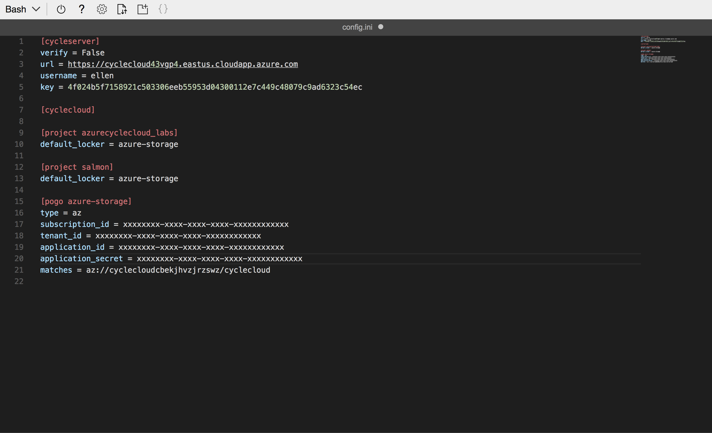

# Deploy a new application to an HPC cluster

The [previous lab](/Lab2/Tutorial.md) introduced CycleCloud Projects as a means
to customize a cluster template. In this lab we'll use a project to install a
custom application on every node of a cluster. This lab builds on our foundation
by showing how projects can be used for complex cluster configuration tasks such
as customizing a VM during its configuration process.

Please send questions or comments to [the Azure CycleCloud PM team](mailto:askcyclecloud@microsoft.com).

## Goals

In this lab you will learn how to:

* Use CycleCloud Projects for installing a custom application in a cluster.
* Stage application installation files in the blobs directory of a project.
* Write a script that is executed on each and every cluster node as it boots.
* Stage configuration files into every cluster node.
* Upload a CycleCloud Project into a storage locker.
* Start a new cluster that uses the new project.

## Pre-requisites

* Standard lab [prerequisites](/README.md#prerequisites)
* [Lab 1](/Lab1/Tutorial.md) and [Lab 2](/Lab2/Tutorial.md), or have a valid
  Azure CycleCloud installation with the CycleCloud CLI (`cyclecloud` command)
  configured

## Customizing Cluster Nodes

When provisioning a VM as a cluster node there are often configuration steps
that need to be performed during the VM boot-up process. It ranges from
something as simple as setting up application path environment variables
to more complicated tasks such as binding a node to an Active Directory
domain. Furthermore, while Azure CycleCloud supports the use of custom images
with baked-in applications, it is not unusual to install applications as part of
the node preparation stage. Delegating these steps to the preparation stage
reduces the tedium of creating custom images for every permutation of
application and application version, especially in development environments.

This lab illustrates how you could use CycleCloud Projects to install
[Salmon](https://combine-lab.github.io/salmon/), a popular bioinformatics
application that is used for quantifying RNA in RNA sequencing experiments.

## CycleCloud Projects

A CycleCloud Project consists of three main components — Templates, Specs,
and Blobs.

**Templates** define the architecture of the CycleCloud cluster.
The describe how the nodes of a cluster are laid out and how each node is
configured.

**Specs** (short for specifications) define the configuration of each node. These
configuration steps are captured in scripts. Zero or more specs may be
assigned to each node in a cluster template.

**Blobs** are collections of files that can be accessed by all cluster nodes
configured to use a spec of a project. You usually store application
installers and sample test data in blobs.

The [CycleCloud Projects reference
page](https://docs.microsoft.com/en-us/azure/cyclecloud/projects) dives into
greater detail on the concepts and examples of this powerful yet flexible
configuration system.

## Installing Salmon using CycleCloud Projects

### A quick note about installing and setting up Salmon

The recommended process for installing Salmon is using
[Bioconda](https://bioconda.github.io), a Conda channel for packaging
bioinformatics tools. Azure CycleCloud comes with an Anaconda project/cluster
type that makes this process simple. However, for the purposes of demonstrating
the CycleCloud Project system we will set up and install Salmon from
scratch.

### 4.1 Creating a new project for Salmon

Use the `cyclecloud project init` command to initialize a new project. If you
have completed [Lab2](/Lab2/Tutorial.md#3.2), you should have a
`cyclecloud_projects` sub-directory in your home directory (if not, you can
create it using the `mkdir` command). You could use that as the base directory
for all of your projects. Go into that sub-directory and initialize a new
project named `salmon`. As before, specify `azure-storage` as the default
locker. Once the project is created, go into the new project directory.

```sh
ellen@Azure:~$ cd cyclecloud_projects/
ellen@Azure:~/cyclecloud_projects$ ls
azurecyclecloud_labs
ellen@Azure:~/cyclecloud_projects$ cyclecloud project init salmon
Project 'salmon' initialized in /home/ellen/cyclecloud_projects/salmon
Default locker: azure-storage
ellen@Azure:~/cyclecloud_projects$ cd salmon
```

A newly initialized project directory contains three sub-directories, one for
each component of a CycleCloud Project: `blobs`, `specs`, and `templates`. A
`project.ini` file that defines project properties is also created:

```sh
ellen@Azure:~/cyclecloud_projects/salmon$ ls
blobs  project.ini  specs  templates
ellen@Azure:~/cyclecloud_projects/salmon$
```

### 4.2 Staging the Salmon installer

* Download the Salmon installation file into the blobs directory (this lab uses Salmon version 0.11.2):

  ```sh
  ellen@Azure:~/cyclecloud_projects/salmon$ cd blobs
  ellen@Azure:~/cyclecloud_projects/salmon/blobs$ wget -q https://github.com/COMBINE-lab/salmon/releases/download/v0.11.2/salmon-0.11.2-linux_x86_64.tar.gz
  ellen@Azure:~/cyclecloud_projects/salmon/blobs$ ls
  salmon-0.11.2-linux_x86_64.tar.gz
  ellen@Azure:~/cyclecloud_projects/salmon/blobs$ cd ..
  ellen@Azure:~/cyclecloud_projects/salmon$
  ```

* Open the `project.ini` file in an editor [Cloud Shell editor](https://azure.microsoft.com/en-us/blog/cloudshelleditor/) (or another editor):

  ```sh
  ellen@Azure:~/cyclecloud_projects/salmon$ code project.ini
  ```

* Edit the file so that it looks like this:

  ```ini
  [project]
  version = 1.0.0
  name = salmon
  type = application

  [blobs]
  files = salmon-0.11.2-linux_x86_64.tar.gz
  ```

* The above edits defined the following:
  * This project is of type `application`
  * The manifest of the `blobs` directory should contain the file `salmon-0.11.2-linux_x86_64.tar.gz`

* Save and exit the editor.

### 4.3 Adding a cluster-init script to the default spec

The `specs` directory contains specs of a project and a project can have one or
more specs. For example, a project may have a `default` spec that contains
configurations steps meant to be performed on every node of a cluster, and also
a `master` spec that contains scripts meant to only be invoked on the cluster's headnode.

A `default` spec is automatically created in each new CycleCloud
project. Within each spec are two sub-directories: `chef` and `cluster-init`

```sh
ellen@Azure:~/cyclecloud_projects/salmon$ cd specs/
ellen@Azure:~/cyclecloud_projects/salmon/specs$ ls
default
ellen@Azure:~/cyclecloud_projects/salmon/specs$ cd default/
ellen@Azure:~/cyclecloud_projects/salmon/specs/default$ ls
chef  cluster-init
ellen@Azure:~/cyclecloud_projects/salmon/specs/default$
```

The `chef` directory is created to hold Chef cookbooks and recipes that can be used in configuring nodes. The [Chef reference page](https://docs.chef.io/chef_overview.html) provides an excellent overview of Chef, but using Chef in CycleCloud Projects will not be covered in this lab.

The `cluster-init` directory contains three sub-directories:

```sh
ellen@Azure:~/cyclecloud_projects/salmon/specs/default$ ls cluster-init/
files  scripts  tests
ellen@Azure:~/cyclecloud_projects/salmon/specs/default$
```

1. `files/`: Small files that are downloaded into each and every cluster node
   using this spec.
2. `scripts/`: Collections of scripts that are executed on each node
   using this spec when the node boots. If there are multiple scripts in this
   directory they are executed in alphanumerical order of their filename.
3. `tests/`: Test scripts used to validate the successful deployment of a spec.
   (Tests will not be covered in this lab)

To illustrate the use of the scripts directory, we will create an install script for Salmon:

* Create a new script named `10.install_salmon.sh` inside the `default/cluster-init/scripts` directory.

    > **Note:** We use "here documents" to simplify the creation of new files. Simply copy all the lines starting with the `cat` command up to and including the `EOF` line, then paste it into Cloud Shell and press Enter. Alternatively, you can use a text editor to create and edit the file.

  ```sh
  ellen@Azure:~/cyclecloud_projects/salmon/specs/default$ cd cluster-init/scripts/
  ellen@Azure:~/cyclecloud_projects/salmon/specs/default/cluster-init/scripts$ cat << EOF > ./10.install_salmon.sh
  #!/bin/bash
  set -ex

  # make a /mnt/resource/apps directory
  # Azure VMs that have ephemeral storage have that mounted at /mnt/resource. If that does not exist this command will create it.
  mkdir -p /mnt/resource/apps

  # Create tempdir
  tmpdir=$(mktemp -d)

  # download salmon installer into tempdir and unpack it into the apps directory
  pushd $tmpdir
  SALMON_VERSION=0.11.2
  jetpack download "salmon-${SALMON_VERSION}-linux_x86_64.tar.gz"
  tar xf salmon-${SALMON_VERSION}-linux_x86_64.tar.gz -C /mnt/resource/apps

  # make the salmon install dir readable by all
  chmod -R a+rX /mnt/resource/apps/salmon-${SALMON_VERSION}-linux_x86_64 

  #clean up
  popd
  rm -rf $tmpdir
  EOF
  ellen@Azure:~/cyclecloud_projects/salmon/specs/default/cluster-init/scripts$
  ```

The contents of the scripts directory should now look like this:

```sh
ellen@Azure:~/cyclecloud_projects/salmon/specs/default/cluster-init/scripts$ ls
10.install_salmon.sh  README.txt
ellen@Azure:~/cyclecloud_projects/salmon/specs/default/cluster-init/scripts$
```

### 4.4 Using the `cluster-init/files` directory to stage files on every node

It is sometimes very useful to stage small files on every node of a cluster.
Examples of these are application configuration parameters or license files.
Here we will use cluster-init to stage environment files in `/etc/profile.d` of
each node so that the `salmon` binary will be in the path of every user.

* Create a new script
  `20.add_salmon_to_path.sh` in the scripts directory of the default spec
  `salmon/specs/default/cluster-init/scripts/`:

  ```sh
  ellen@Azure:~/cyclecloud_projects/salmon/specs/default/cluster-init/scripts$ cat << EOF > ./20.add_salmon_to_path.sh
  #! /bin/bash

  # create a symlink to the salmon directory
  SALMON_VERSION=0.11.2
  ln -s /mnt/resource/apps/salmon-${SALMON_VERSION}-linux_x86_64 /mnt/resource/apps/salmon

  # add the profile files into /etc/profile.d
  cp $CYCLECLOUD_SPEC_PATH/files/salmon.sh /etc/profile.d/
  cp $CYCLECLOUD_SPEC_PATH/files/salmon.csh /etc/profile.d/

  # make sure both are readable and executable
  chmod a+rx /etc/profile.d/salmon.*
  EOF
  ellen@Azure:~/cyclecloud_projects/salmon/specs/default/cluster-init/scripts$
  ```

* Next, navigate to the sibling `files/` directory and create two files, `salmon.sh` and `salmon.csh`:

  ```sh
  ellen@Azure:~/cyclecloud_projects/salmon/specs/default/cluster-init/scripts$ cd ../files
  ellen@Azure:~/cyclecloud_projects/salmon/specs/default/cluster-init/files$ cat << EOF > ./salmon.sh
  #!/bin/sh
  export PATH=$PATH:/mnt/resource/apps/salmon/bin
  EOF
  ellen@Azure:~/cyclecloud_projects/salmon/specs/default/cluster-init/files$ cat << EOF > ./salmon.csh
  #!/bin/csh
  setenv PATH $PATH\:/mnt/resource/salmon/bin
  EOF
  ellen@Azure:~/cyclecloud_projects/salmon/specs/default/cluster-init/files$
  ```

* Review the files in the `salmon` project's default spec:

  ```sh
  ellen@Azure:~/cyclecloud_projects/salmon/specs/default/cluster-init/files$ cd ..
  ellen@Azure:~/cyclecloud_projects/salmon/specs/default/cluster-init$ ls scripts/
  10.install_salmon.sh  20.add_salmon_to_path.sh  README.txt
  ellen@Azure:~/cyclecloud_projects/salmon/specs/default/cluster-init$ ls files/
  README.txt  salmon.csh  salmon.sh
  ellen@Azure:~/cyclecloud_projects/salmon/specs/default/cluster-init$
  ```

### 4.5 Uploading the CycleCloud project into the storage locker

One of the steps in setting up a new Azure CycleCloud installation is the
creation of an Azure storage account and an accompanying blob container. This
container is the *"Locker"* that the CycleCloud server uses to stage CycleCloud
projects for cluster nodes. CycleCloud cluster nodes orchestrated by this
CycleCloud server are configured to download CycleCloud projects from this
locker as part of the boot-up process of the node.

* A storage account and container was created as part of the ARM installation
  process in [Lab 1](/Lab1/Tutorial.md). To see this locker, use the
  `cyclecloud locker list` command:

  ```sh
  ellen@Azure:~/cyclecloud_projects/salmon/specs/default/cluster-init$ cd
  ellen@Azure:~$ cyclecloud locker list
  azure-storage (az://cyclecloudcbekjhvzjrzswz/cyclecloud)
  ellen@Azure:~$
  ```

  In this example, the storage account name is
    `cyclecloudcbekjhvzjrzswz`, and the blob container name is `cyclecloud`. 

The `cyclecloud project upload` command packages up the contents of the project
and uploads it into the locker. To do this it needs to have credentials to
access the blob container associated with the locker. You could create a [SAS
key for the
container](https://docs.microsoft.com/en-us/cli/azure/storage/account?view=azure-cli-latest#az-storage-account-generate-sas)
and use that, but for the purpose of this lab [the service principal from Lab
1](/Lab1/Tutorial.md#1.5) will be used.  

* Edit the cyclecloud configuration file `~/.cycle/config.ini`:

  ```sh
  ellen@Azure:~$ code ~/.cycle/config.ini
  ellen@Azure:~$
  ```

* Add the section below, with `subscription_id`, `tenant_id`, `application_id`,
  `application_secret` matching those in the service principal used in Lab

  Also replace the storage account name `cyclecloudcbekjhvzjrzswz` with the output of the `cyclecloud locker list` command:

  ```ini
  [pogo azure-storage]
  type = az
  subscription_id = xxxxxxxx-xxxx-xxxx-xxxx-xxxxxxxxxxxx
  tenant_id = xxxxxxxx-xxxx-xxxx-xxxx-xxxxxxxxxxxx
  application_id = xxxxxxxx-xxxx-xxxx-xxxx-xxxxxxxxxxxx
  application_secret = xxxxxxxx-xxxx-xxxx-xxxx-xxxxxxxxxxxx
  matches = az://cyclecloudcbekjhvzjrzswz/cyclecloud
  ```

  _You can locate your Subscription ID using the Azure CLI (`az` command) to
  list the accounts:_ `az account list -o table`

* Your `~/.cycle/config.ini` should now look something like this

  

* Upload the project from its directory

  ```sh
  ellen@Azure:~$ cd ~/cyclecloud_projects/salmon/
  ellen@Azure:~/cyclecloud_projects/salmon$ cyclecloud project upload
  Uploading to az://cyclecloudcbekjhvzjrzswz/cyclecloud/projects/salmon/1.0.0 (100%)
  Uploading to az://cyclecloudcbekjhvzjrzswz/cyclecloud/projects/salmon/blobs (100%)
  Upload complete!
  ellen@Azure:~/cyclecloud_projects/salmon$
  ```

### 4.6 Create a new Cluster with the Salmon Project

Having uploaded the salmon project into the CycleCloud locker, you can now
create a new cluster in CycleCloud and specify that each node should use the
`salmon:default` spec. In this lab we will use Grid Engine as the base scheduler.

* From the Cluster page of your Azure CycleCloud web portal, use the "+" symbol in
  the bottom-left-hand corner of the page to add a new Grid Engine cluster:

  

* Give the cluster a descriptive name and complete the *Required Settings* as
  [done previously](/Lab1/Tutorial.md#2.1).

  

* Navigate to the *Advanced Settings* section. Under the *Software* section,
  click on the "Browse" button for "Master Cluster-Init" which will open a file
  selector dialog:
  

* You will see a folder named `salmon/`. Open it by double-clicking it. Then
  open the `1.0.0/` folder. Finally, select the `default/` folder by clicking on
  it once and pressing the "Select" button on the bottom of the dialog window.
  After pressing "Select" the file selector dialog will close. This selects the
  `default` spec of version `1.0.0` of the project `salmon`.
  

* Repeat this selection step for "Execute Cluster-Init". When you're done, the
  *Advanced Settings* page should look like this:
  

* Save the cluster and start it. When the master node turns green, [log into
  it](/Lab1/Tutorial.md#2.2) and verify that `salmon` has been installed:

  ```sh
  ellen@Azure:~$ ssh ellen@40.117.78.137

   __        __  |    ___       __  |    __         __|
  (___ (__| (___ |_, (__/_     (___ |_, (__) (__(_ (__|
          |

  Cluster: SalmonCluster
  Version: 7.5.0
  Run List: recipe[cyclecloud], role[central_manager], role[application_server], role[sge_master_role], role[scheduler], role[monitor], recipe[cluster_init]
  [ellen@ip-0A000404 ~]$ salmon
  salmon v0.11.2

  Usage:  salmon -h|--help or
          salmon -v|--version or
          salmon -c|--cite or
          salmon [--no-version-check] <COMMAND> [-h | options]

  Commands:
      index Create a salmon index
      quant Quantify a sample
      alevin single cell analysis
      swim  Perform super-secret operation
      quantmerge Merge multiple quantifications into a single file
  ```
