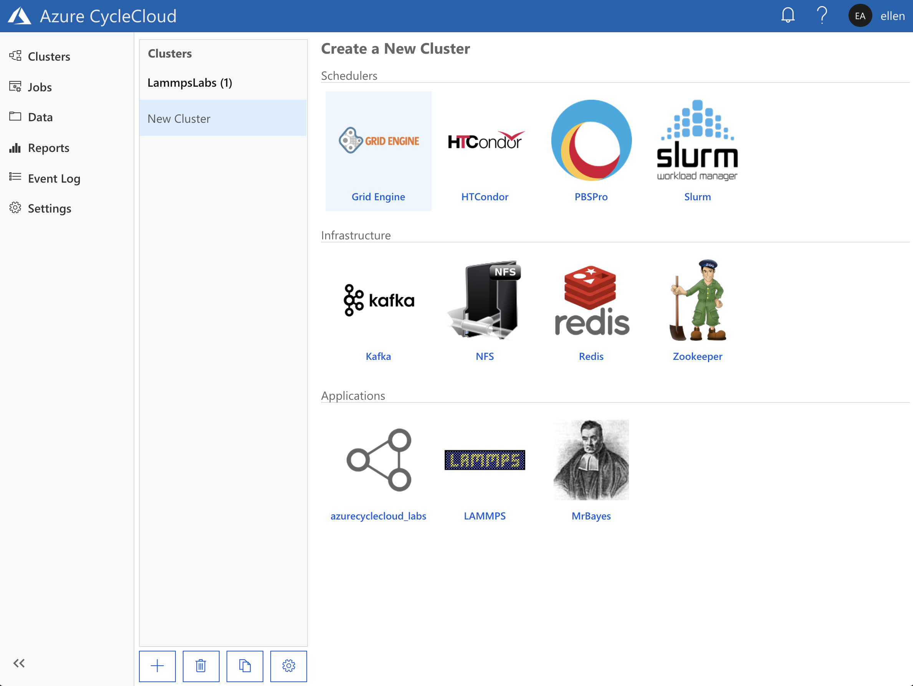
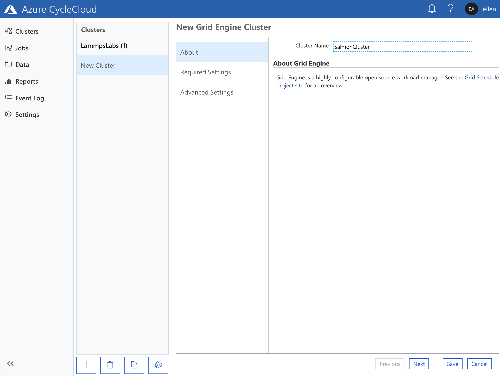
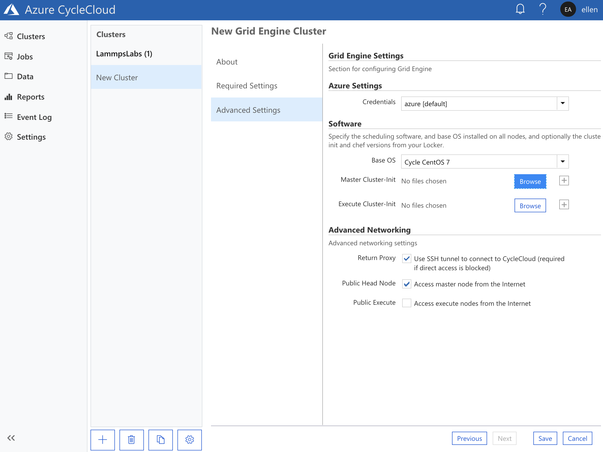
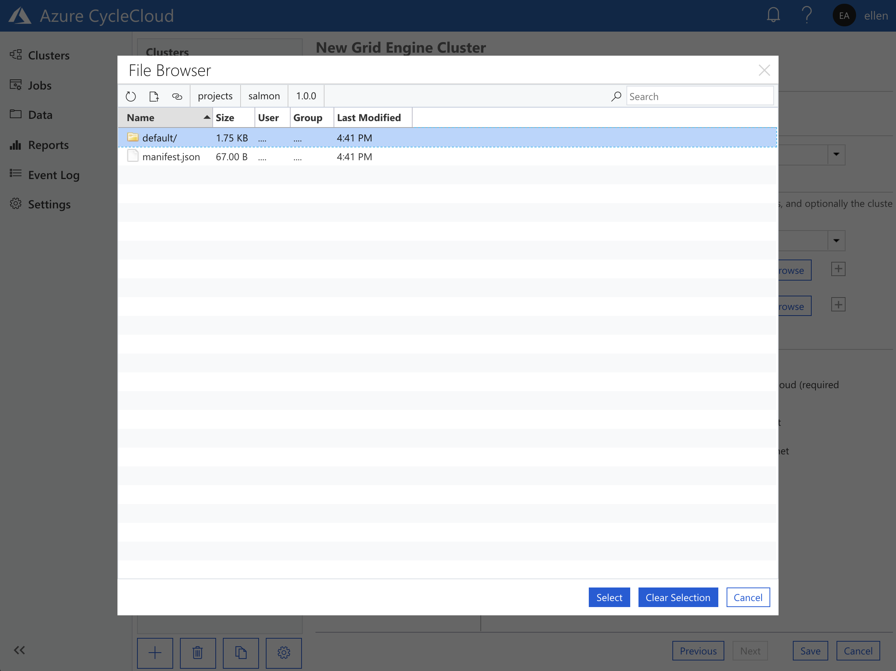
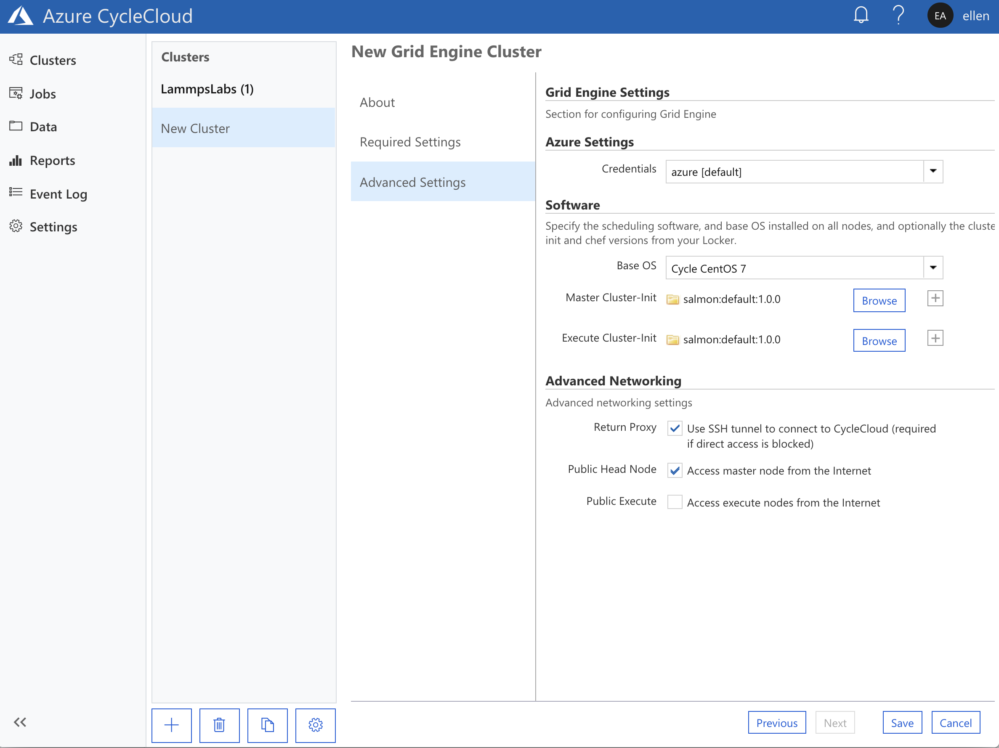

# Deploy a new application to a HPC cluster
When provisioning a VM as a cluster node there are often configuration steps
that need to be performed during the VM boot-up process. It may range from
something simple such as setting up application paths as environment variables
for all users, or a more complicated process such as binding a node to an Active
Directory domain. Furthermore, while Azure CycleCloud supports to use of custom
images with applications compiled an baked into the image, it is not unusual to
install applications during the node preparation stage instead. Delegating these
steps to the preparation stage reduces the tedium of creating custom images for
every permutation of application and application version, especially in
development environments.

This tutorial illustrates how you could use CycleCloud project to install
[Salmom](https://combine-lab.github.io/salmon/), a popular bioinformatics
application that is used for quantifying RNA in RNA sequencing samples.

## CycleCloud Projects

The previous tutorial briefly introduced the concept of CycleCloud projects as a
means of creating a custom cluster template. This section extends the use of
CycleCloud Projects and illustrates how one would use it to customize a VM
during its configuration process. 

A CycleCloud Project consist of three main sections -- cluster templates, specs,
and blobs (files). Templates define the architecture of the CycleCloud cluster;
it describes how the nodes of a cluster are laid out and how each node is
configured. Specs (Specifications) define the configuration steps of nodes using
the spec. These configuration steps are captured in scripts, and zero or more
specs may be assigned to each node in a cluster template. Blobs are collections
of files that can be accessed by all cluster nodes that are configured to use a
spec of a project. You would usually store application installers and sample
test data in blobs. 

The [CycleCloud Projects documentation
page](https://docs.microsoft.com/en-us/azure/cyclecloud/projects) dives into
more detail on the concepts of projects, and more examples for extending this
flexible tooling system. 

## Installing Salmon using CycleCloud Projects

### A quick note about installing and setting up Salmon

The recommended process for installing Salmon is using
[Bioconda](https://bioconda.github.io), a Conda channel for packaging
bioinformatics tools. Azure CycleCloud comes with a Anaconda project/cluster
type that makes this process simple. However, for the purposes of demonstrating
the CycleCloud Project system this tutorial will setup and install Salmon from
scratch.

### 4.1 Creating a new project for Salmon
Use the `cyclecloud project init` command to initialize a new project. If you
have completed the [previous
tutorial](../Lab2/Tutorial.md#32-creating-a-new-cyclecloud-project), you would
have a `cyclecloud_project` sub-directory in your home direction. You could use
that as the base directory for all of your projects. Go into that sub-directory,
initialize a new project named `salmon` and descend into the new project
directory:
```
ellen@Azure:~$ cd cyclecloud_projects/
ellen@Azure:~/cyclecloud_projects$ ls
azurecyclecloud_labs
ellen@Azure:~/cyclecloud_projects$ cyclecloud project init salmon
Project 'salmon' initialized in /home/ellen/cyclecloud_projects/salmon
Default locker: azure-storage
ellen@Azure:~/cyclecloud_projects$ cd salmon
```

A newly initialized project directory contains 3 sub-directories, one for each
segment that constitutes a CycleCloud Project: `blobs`, `specs`, and
`templates`, as well as a `project.ini` file that defines attributes for the
project:
```
ellen@Azure:~/cyclecloud_projects/salmon$ ls
blobs  project.ini  specs  templates
ellen@Azure:~/cyclecloud_projects/salmon$
```

### 4.2 Staging the Salmon installer
Download the installation file for Salmon and stage it into the blobs directory.
- Download Salmon into the blobs directory (this tutorial uses Salmon version
  0.11.2):
```
ellen@Azure:~/cyclecloud_projects/salmon$ cd blobs
ellen@Azure:~/cyclecloud_projects/salmon/blobs$ wget -q https://github.com/COMBINE-lab/salmon/releases/download/v0.11.2/salmon-0.11.2-linux_x86_64.tar.gz
ellen@Azure:~/cyclecloud_projects/salmon/blobs$ ls
salmon-0.11.2-linux_x86_64.tar.gz
ellen@Azure:~/cyclecloud_projects/salmon/blobs$ cd ..
ellen@Azure:~/cyclecloud_projects/salmon$
```

- Edit the `project.ini` file using VSCode in Cloud Shell or your favorite
  editor, so that it looks like this:

```INI
[project]
version = 1.0.0
name = salmon
type = Application

[blobs]
Files = salmon-0.11.2-linux_x86_64.tar.gz

```

- The above edits defined the following:
    * This project is of type `application`
    * The manifest of the `blobs` directory should contain the file
      `salmon-0.11.2-linux_x86_64.tar.gz`

### 4.3 Adding a cluster-init script to the default spec

The `specs` directory contains specs of a project and a project can have one or
many specs. For example, a project may have a `default` spec that contains
configurations steps meant to be performed on every node of a cluster, and also
a `master` spec that contain scripts meant to be evoked only on the headnode of
the cluster.

A `default` spec is automatically created in each newly initialized CycleCloud
project, and within that are two sub-directories: `chef` and `cluster-init` 
```
ellen@Azure:~/cyclecloud_projects/salmon$ cd specs/
ellen@Azure:~/cyclecloud_projects/salmon/specs$ lsdefault
ellen@Azure:~/cyclecloud_projects/salmon/specs$ cd default/
ellen@Azure:~/cyclecloud_projects/salmon/specs/default$ ls
chef  cluster-init
ellen@Azure:~/cyclecloud_projects/salmon/specs/default$
```

The `chef` directory is created to hold Chef cookbooks and recipes that can be
used in configuring nodes. The [Chef documentation
page](https://docs.chef.io/chef_overview.html) provides an excellent overview of
Chef, but using Chef in CycleCloud projects will not be covered in this
tutorial. 

The `cluster-init` directory contains three sub-directories:
```
ellen@Azure:~/cyclecloud_projects/salmon/specs/default$ ls cluster-init/
files  scripts  tests
ellen@Azure:~/cyclecloud_projects/salmon/specs/default$
```
1. `files`: Small files that are downloaded into each and every cluster node
   using this spec
2. `scripts`: Collections of scripts that are executed on each and every node
   using this spec when the node boots. If there are multiple scripts in this
   directory they are executed in alphanumerical order of their filename. 
3. `tests`: Test scripts used to validate the successful deployment of a spec
   (Tests will not be covered in this tutorial)


To illustrate the use of the scripts directory, we will create an install script
for salmon: 

- Create and edit a new script inside the default/cluster-init/scripts directory
  named `10.install_salmon.sh` using VSCode in Cloud Shell or your favorite text
  editor:
```
ellen@Azure:~/cyclecloud_projects/salmon/specs/default$ cd cluster-init/scripts/
ellen@Azure:~/cyclecloud_projects/salmon/specs/default/cluster-init/scripts$ code 10.install_salmon.sh
ellen@Azure:~/cyclecloud_projects/salmon/specs/default/cluster-init/scripts$
```

- Add the following into `10.install_salmon.sh`
```BASH
#!/bin/bash
set -ex

# make a /mnt/resource/apps directory
# Azure VMs that have ephemeral storage have that mounted at /mnt/resource. If that does not exist this command will create it.
mkdir -p /mnt/resource/apps

# Create tempdir
tmpdir=$(mktemp -d)

# download salmon installer into tempdir and unpack it into the apps directory
pushd $tmpdir
SALMON_VERSION=0.11.2
jetpack download "salmon-${SALMON_VERSION}-linux_x86_64.tar.gz"
tar xf salmon-${SALMON_VERSION}-linux_x86_64.tar.gz -C /mnt/resource/apps

# make the salmon install dir readable by all
chmod -R a+rX /mnt/resource/apps/salmon-${SALMON_VERSION}-linux_x86_64 

#clean up
popd
rm -rf $tmpdir
```

The contents of the scripts directory should now look like this:
```
ellen@Azure:~/cyclecloud_projects/salmon/specs/default/cluster-init/scripts$ ls
10.install_salmon.sh  README.txt
ellen@Azure:~/cyclecloud_projects/salmon/specs/default/cluster-init/scripts$
```


### 4.4 Using the cluster-init/files directory to stage files on every node

It is sometimes very useful to stage small files on every node of a cluster.
Examples of such files are config parameters for applications or license files.
Here, we will use the cluster-init to stage environment files in /etc/profile.d
of each node so that the salmon binary will be in the PATH of every user.

- Using VSCode in Cloud Shell again or your favorite editor, create a new script
  `20.add_salmon_to_path.sh` in the scripts directory of the spec
  `salmon/specs/default/cluster-init/scripts/`:

    * `20.add_salmon_to_path.sh`:
    ```BASH
    #! /bin/bash

    # create a symlink to the salmon directory
    SALMON_VERSION=0.11.2
    ln -s /mnt/resource/apps/salmon-${SALMON_VERSION}-linux_x86_64 /mnt/resource/apps/salmon

    # add the profile files into /etc/profile.d
    cp $CYCLECLOUD_SPEC_PATH/files/salmon.sh /etc/profile.d/
    cp $CYCLECLOUD_SPEC_PATH/files/salmon.csh /etc/profile.d/

    # make sure both are readable and executable
    chmod a+rx /etc/profile.d/salmon.*
    ```

- Next, using the editor again, create two files in files directory of the spec
  `salmon/specs/default/cluster-init/files/`:
    1. `salmon/specs/default/cluster-init/files/salmon.sh`:
    ```SH
    #!/bin/sh
    export PATH=$PATH:/mnt/resource/apps/salmon/bin
    ```

    2. `salmon/specs/default/cluster-init/files/salmon.csh`:

    ```SH
    #!/bin/csh
    setenv PATH $PATH\:/mnt/resource/salmon/bin
    ```

- The contents of the default spec for salmon should now look like this:
    ```
    ellen@Azure:~/cyclecloud_projects/salmon/specs/default/cluster-init$ ls scripts/
    10.install_salmon.sh  20.add_salmon_to_path.sh  README.txt
    ellen@Azure:~/cyclecloud_projects/salmon/specs/default/cluster-init$ ls files/
    README.txt  salmon.csh  salmon.sh
    ellen@Azure:~/cyclecloud_projects/salmon/specs/default/cluster-init$
    ```


### 4.5 Uploading the CycleCloud project into the storage locker

One of the steps in setting up a new Azure CycleCloud installation is the
creation of an Azure storage account and accompanying blob container. This
container is the *"Locker"* that the CycleCloud server uses to stage CycleCloud
projects for clusuter nodes. CycleCloud cluster nodes orchestrated by this
CycleCloud server are configured to download CycleCloud projects from this
locker as part of the boot-up process of the node.

- This storage account and container was created as part of the ARM installation
  process in tutorial 1. To see this locker, use the `cyclecloud locker list`
  command:
    ```
    ellen@Azure:~$ cyclecloud locker list
    azure-storage (az://cyclecloudcbekjhvzjrzswz/cyclecloud)
    ellen@Azure:~$
    ```
  * In this above example, the storage account name is
    `cyclecloudcbekjhvzjrzswz`, and the blob container name is `cyclecloud`. 


The `cyclecloud project upload` command packages up the contents of the project and uploads it into the locker. To do this, it needs to have the credentials to access the blob container associated with the locker. You could create a SAS keys for the container and use that, but for the purposes of this tutorial the service principal used in tutorial #1 will be used.  

- Edit the cyclecloud config file `~/.cycle/config.ini`:
```
ellen@Azure:~$ code ~/.cycle/config.ini
ellen@Azure:~$
```

- Add this section below, with `subscription_id`, `tenant_id`, `application_id`, `application_secret` matching those in the service principal used in tutorial 1. Also replace the storage account name `cyclecloudcbekjhvzjrzswz` with the output of the `cyclecloud locker list` command:
```INI
[pogo azure-storage]
type = az
subscription_id = xxxxxxxx-xxxx-xxxx-xxxx-xxxxxxxxxxxx
tenant_id = xxxxxxxx-xxxx-xxxx-xxxx-xxxxxxxxxxxx
application_id = xxxxxxxx-xxxx-xxxx-xxxx-xxxxxxxxxxxx
application_secret = xxxxxxxx-xxxx-xxxx-xxxx-xxxxxxxxxxxx
matches = az://cyclecloudcbekjhvzjrzswz/cyclecloud
```
_If you can't locate your subscription_id, use the AZ CLI in the Azure shell to list the accounts:_ `az account list -o table`

- With the locker credentials staged, go into the project directory and upload the project
```
ellen@Azure:~$ cd ~/cyclecloud_projects/salmon/
ellen@Azure:~/cyclecloud_projects/salmon$ cyclecloud project upload
Uploading to az://cyclecloudcbekjhvzjrzswz/cyclecloud/projects/salmon/1.0.0 (100%)
Uploading to az://cyclecloudcbekjhvzjrzswz/cyclecloud/projects/salmon/blobs (100%)
Upload complete!
ellen@Azure:~/cyclecloud_projects/salmon$
```

### 4.6 Create a new Cluster with the Salmon Project
Having uploaded the salmon project into the CycleCloud locker, you can now create a new cluster in CycleCloud and specify that each node should use the salmon:default spec. In this tutorial we shall use Grid Engine as the base scheduler. 

- From the Cluster page of your Azure CycleCloud server, use the "+" symbol near the bottom-left-hand corner of the page to add a new Grid Engine cluster



- Name the cluster as you wish and complete the *Required Settings* as before in the previous tutorials.



- Under the *Software* section of the the *Advanced Settings* page, there is a Browse button for both "Master cluster-init" and "Execute cluster-init". Use the browse button in the *Software* section to bring up a file-selector pop-up that allows you to browse the locker where projects are stored. 



- In the file-selector, select the `default` spec of version `1.0.0` of the project `salmon`: salmon -> 1.0.0 -> default



- Do the same for both the master and execute nodes. The *Advanced Settings* page should end up looking like this:



- Start the cluster and when the master node turns green, SSH in to verify that salmon has been installed:
```
ellen@Azure:~$ ssh ellen@${ClusterIPAddress}

 __        __  |    ___       __  |    __         __|
(___ (__| (___ |_, (__/_     (___ |_, (__) (__(_ (__|
        |

Cluster: SalmonCluster
Version: 7.5.0
Run List: recipe[cyclecloud], role[central_manager], role[application_server], role[sge_master_role], role[scheduler], role[monitor], recipe[cluster_init]
[ellen@ip-0A000404 ~]$ salmon
salmon v0.11.2

Usage:  salmon -h|--help or
        salmon -v|--version or
        salmon -c|--cite or
        salmon [--no-version-check] <COMMAND> [-h | options]

Commands:
     index Create a salmon index
     quant Quantify a sample
     alevin single cell analysis
     swim  Perform super-secret operation
     quantmerge Merge multiple quantifications into a single file
```

